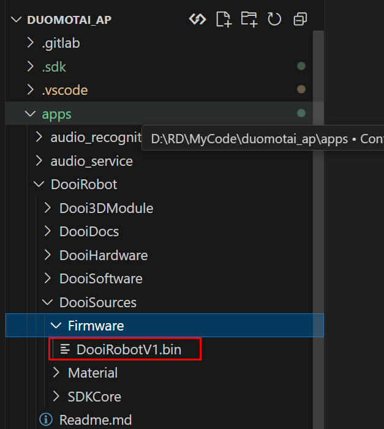
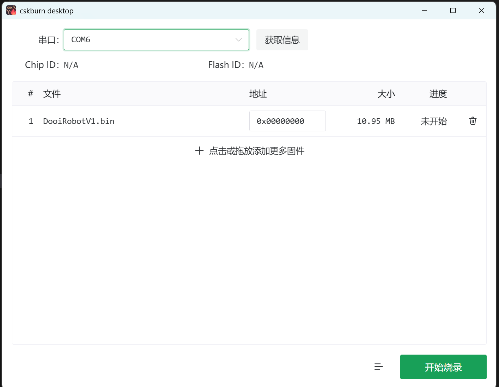
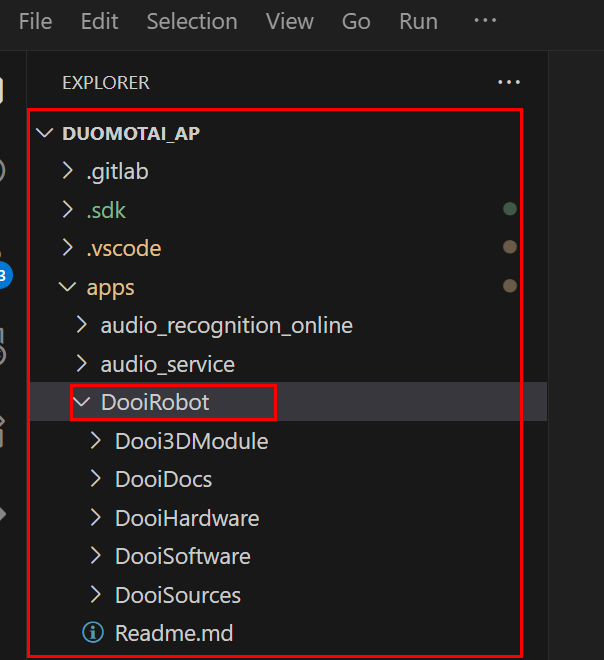

# DooiRobot

## 概述

该项目由doly魔改而来，3D模型做了适配，硬件以及软件为自制，采用聆思的CSK6；

请用 “嘿、dooi” 唤醒我

当前支持功能如下：

1、单轮多轮对话，打断唤醒

2、支持情绪理解，多种情感反馈（眼睛、led、舵机、电机的结合）

3、支持物体识别、拍照等

4、支持音乐播放

5、支持蓝牙配网，局域网web控制

6、

- [视频演示]()
- 

## 固件烧录

1、[下载烧录软件](https://docs2.listenai.com/zz/6941.exe?shortId=oo2_KzYFd)

2、将bin固件拖至软件





3、点击烧录后，立刻点击开发版的boot按键，开始烧录

## 软件环境搭建

1、安装lisa环境及获取SDK：[参考文档](https://docs2.listenai.com/x/xfI6rkDCKmW)

2、获取项目

```
cd /duomotai_ap/apps
git clone https://github.com/Acoucou/DooiRobot.git
```

最终目录如下图，没有git也可以直接将下载下来的项目放置于apps目录下（主要是方便脚本执行）



3、执行拷贝脚本，拷贝文件到SDK

```
cd DooiRobot/DooiSources/SDKCore
./copy_shell.bat  			// 执行脚本
```

4、编译程序

```
cd duomotai_ap
lisa zep build -b csk6_dooi_robot_v1 .\apps\DooiRobot\DooiSoftware -p
```

5、烧录

```
lisa zep exec cskburn -s \\.\COM6 -C 6 -b 1500000 0x000000 .\build\zephyr\zephyr.bin  
```

## 平台

[aiui](https://aiui.xfyun.cn/user/login?pageFrom=https%3A%2F%2Faiui.xfyun.cn%2Fapp)

[聆思后台](https://platform.listenai.com/application)

[唤醒词替换文档](https://tool.listenai.com/audio-custom/products/)

[替换应答语](https://docs2.listenai.com/x/txcGbh4g-) ： lisa zep exec mklfs apps\LLM_pic\resource\tone\ littlefs.bin 0x100000

[应答音频合成](https://www.iflyos.cn/tts-file)
